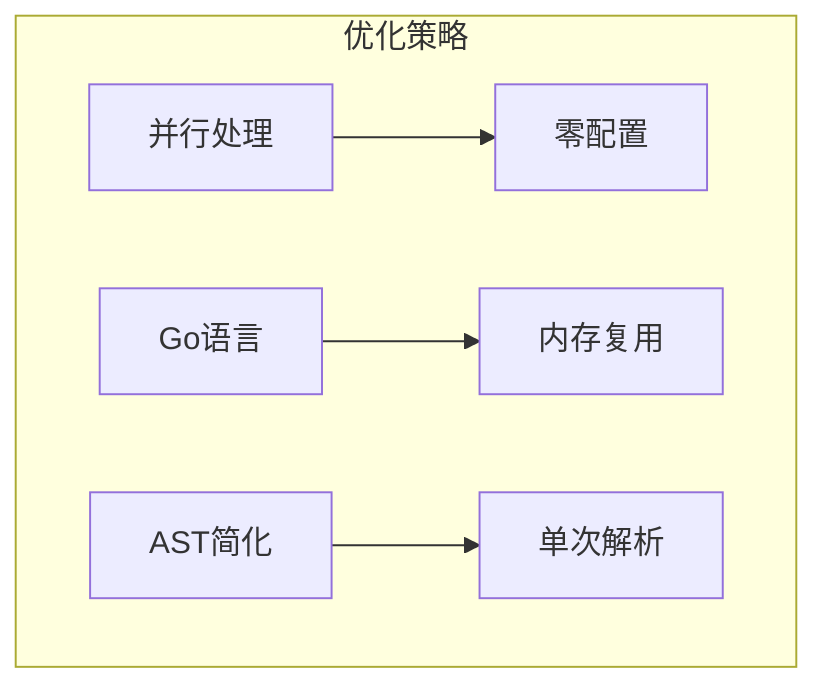

# ESBuild

## 简介

ESBuild 是用 Go 语言编写的超快的 JavaScript/TypeScript 打包工具。它的主要特点是构建速度极快，通常比传统打包工具快 10-100 倍。

## 为什么快



- Go 编写，无需 JavaScript 引擎
- 并行处理，充分利用 CPU
- 从零构建，没有运行时开销
- 经过优化的内存使用

## 核心功能

### 1. 基础能力
- 打包（Bundling）
- 压缩（Minification）
- TypeScript/JSX 编译
- Source Maps 生成

### 2. 常用配置
```js
require('esbuild').build({
  entryPoints: ['app.js'],
  bundle: true,
  minify: true,
  sourcemap: true,
  target: ['chrome58'],
  outfile: 'out.js'
})
```

## 使用场景

- 开发工具的底层依赖（如 Vite）
- 简单项目的直接构建
- CI/CD 流程中的代码构建
- 库的打包构建