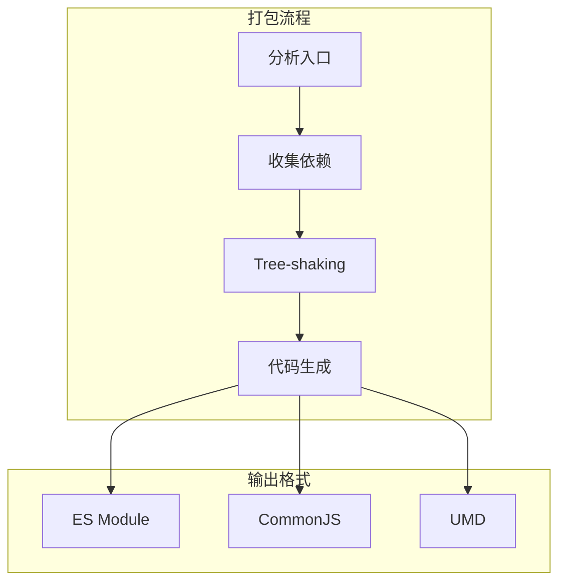

# Rollup

## 简介

Rollup 是一个专注于 ES 模块打包的工具，以高效的代码打包和 Tree-shaking 能力著称，特别适合库的打包。

## 工作原理



## 核心特性

### 1. Tree-shaking
- 自动移除未使用代码
- 基于 ES 模块静态分析
- 支持副作用标记

### 2. 多种输出
- ES Module (esm)
- CommonJS (cjs)
- UMD
- IIFE

### 3. 配置示例
```js
// rollup.config.js
export default {
  input: 'src/main.js',
  output: {
    file: 'bundle.js',
    format: 'esm'
  },
  plugins: [
    resolve(),
    commonjs()
  ]
}
```

## 最佳实践

- 库的打包首选工具
- 配合插件处理各类资源
- 输出多种模块格式
- 配合 Terser 进行代码压缩
