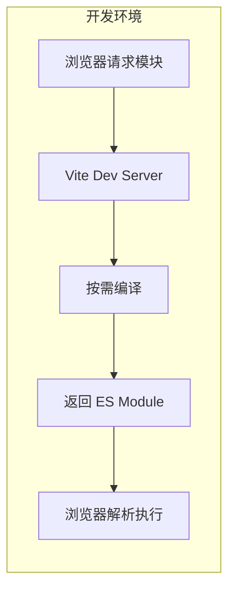
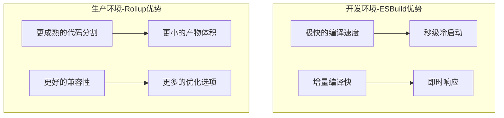

# Vite

## 简介

Vite 是新一代的前端构建工具，利用浏览器原生 ES 模块能力和 esbuild 预构建，实现了极快的开发服务器启动和热更新。

## 优缺点

### 优点
- 开发服务器启动快，无需打包
- 热更新速度快且准确
- 开箱即用，配置简单
- 对 TypeScript、JSX、CSS 等有良好支持

### 缺点
- 生产构建仍依赖 Rollup
- 插件生态相对较新
- 仅支持 ES2015+ 浏览器

## 工作原理




## 构建工具选择



### 为什么开发用 ESBuild
- 开发环境需要频繁重新构建，ESBuild 的速度优势明显
- 不需要代码分割等复杂优化
- 浏览器支持 ESM，可以按需加载

### 为什么生产用 Rollup
- 更成熟的代码分割能力
- 生成更小的包体积
- 更好的浏览器兼容性
- 插件生态更丰富

## 核心功能

### 1. 预构建
- 将 CommonJS 转换为 ESM
- 合并多个模块，减少请求
- 缓存结果提升性能

### 2. HMR
- 精确定位变更模块
- 无需重新加载页面
- 保持应用状态

### 3. 常用配置
```js
export default {
  // 开发服务器选项
  server: {
    port: 3000,
    https: false
  },
  // 构建选项
  build: {
    target: 'modules',
    minify: 'esbuild'
  },
  // 依赖优化
  optimizeDeps: {
    include: ['vue']
  }
}
```
