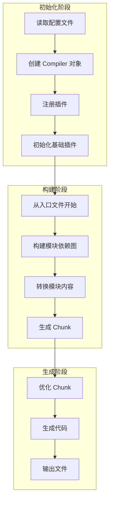
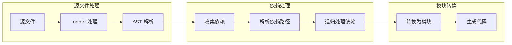
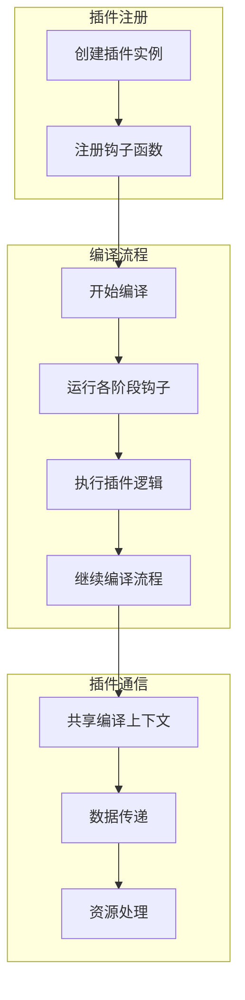
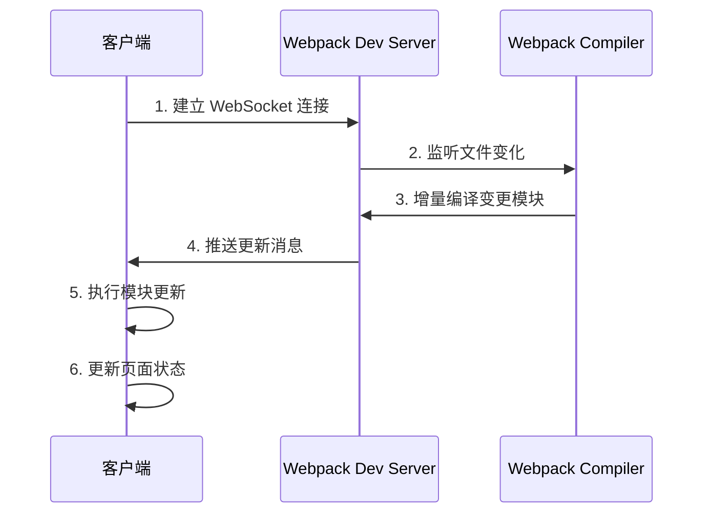
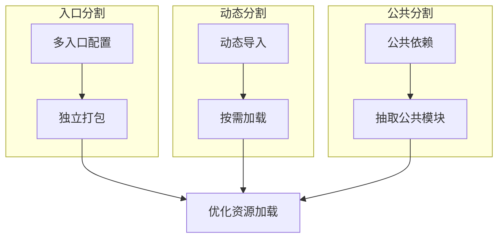
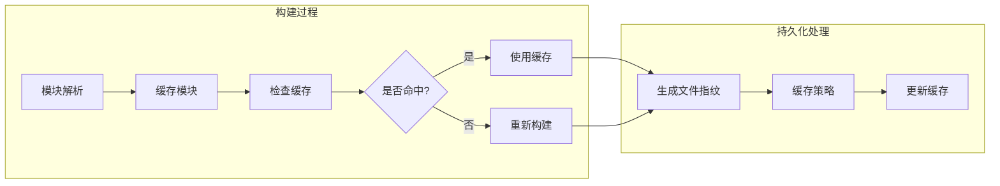

# Webpack

## 简介

Webpack 是一个现代 JavaScript 应用程序的静态模块打包工具。它将项目中的所有资源（JavaScript、CSS、图片等）视为模块，通过构建依赖关系图，实现模块化开发和资源的优化管理。

### 核心概念
1. **Entry（入口）**：构建依赖图的起点
2. **Output（输出）**：打包后资源的输出位置和命名
3. **Loader（加载器）**：处理非 JavaScript 文件的转换器
4. **Plugin（插件）**：扩展 Webpack 功能的插件系统
5. **Module（模块）**：各种资源文件，包括 JavaScript、CSS、图片等

## 优缺点

### 优点
- 统一的模块化方案，支持处理各种资源（JS、CSS、图片等）
- 强大的生态系统和社区支持
- 开发体验好，支持热更新和 Source Map
- 丰富的优化功能，如代码分割、tree shaking

### 缺点
- 配置较复杂，学习成本高
- 打包速度较慢，尤其是大型项目
- 对于简单项目来说过于重量级

## 适用场景

1. **现代 Web 应用**
   - 单页面应用（SPA）
   - 复杂的前端项目
   - 需要代码分割的应用

2. **企业级应用**
   - 大型项目
   - 多人协作开发
   - 需要严格的代码质量控制

3. **性能敏感的应用**
   - 需要代码优化
   - 需要资源压缩
   - 需要按需加载

## 核心原理

### 1. 构建流程

1. **初始化阶段**
   - 读取配置文件
   - 创建 Compiler 对象
   - 注册插件

2. **构建阶段**
   - 从入口文件开始解析
   - 构建模块依赖图（Module Graph）
   - 转换模块内容
   - 生成 Chunk

3. **生成阶段**
   - 优化和合并 Chunk
   - 生成最终代码
   - 输出打包文件

### 整体构建流程

### 2. 模块解析

1. **依赖解析**
   - 解析 import/require 语句
   - 处理路径解析
   - 构建依赖关系树

2. **模块转换**
   - 使用对应的 loader 处理文件
   - 转换模块内容
   - 生成 AST 并分析依赖

3. **模块集成**
   - 将模块转换为内部模块格式
   - 处理模块间的依赖关系
   - 生成运行时代码

### 模块解析流程

### 3. 打包原理

1. **模块封装**
   - 将模块转换为函数
   - 注入运行时环境
   - 处理模块导入导出

2. **依赖管理**
   - 实现模块加载系统
   - 处理循环依赖
   - 管理模块执行顺序

3. **代码生成**
   - 合并模块代码
   - 注入运行时辅助函数
   - 生成 source map

### 4. 插件机制

1. **Tapable 事件流**
   - 基于钩子系统
   - 支持同步和异步事件
   - 实现插件之间的协作

2. **生命周期钩子**
   - 编译开始前
   - 模块解析中
   - 资源生成时
   - 输出完成后

3. **插件通信**
   - 共享编译上下文
   - 访问和修改编译资源
   - 插件间数据传递

### 插件系统工作流程

### 模块热替换流程

### 代码分割策略

### 缓存优化流程

## 常用配置

### 1. 性能优化

1. **代码分割策略**
   - 入口点分割
   - 动态导入
   - 公共代码提取

2. **缓存优化**
   - 持久化缓存
   - 模块标识符优化
   - 运行时代码分离

3. **体积优化**
   - Tree Shaking
   - Scope Hoisting
   - 压缩和混淆

### 2. 开发体验优化

1. **构建速度优化**
   - 缩小构建目标
   - 利用缓存
   - 并行处理

2. **调试优化**
   - Source Map 配置
   - 错误处理
   - 日志优化

3. **模块热替换**
   - HMR 运行时
   - 状态保持
   - 更新策略
