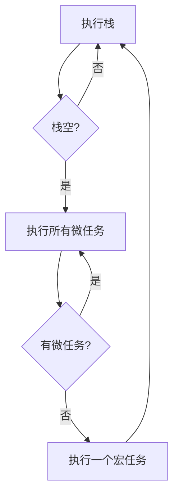
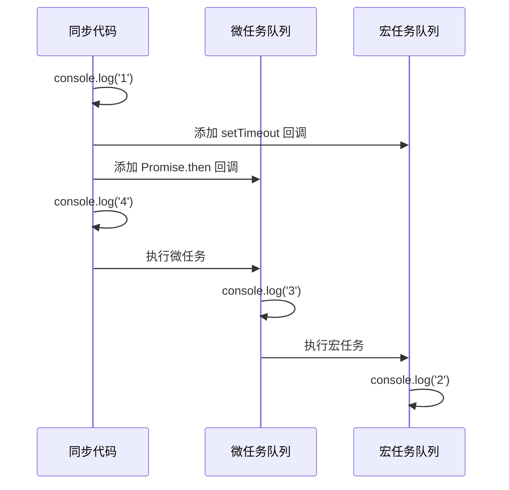
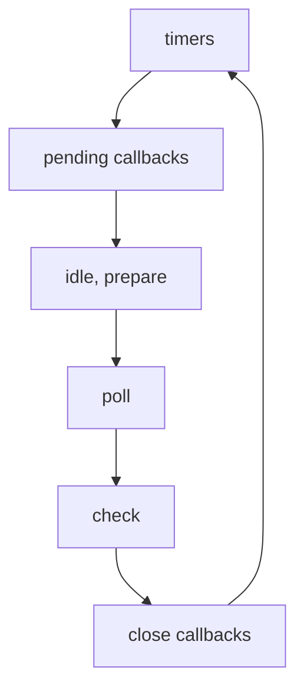

# JavaScript 事件循环机制

JavaScript 是单线程语言，通过事件循环机制实现异步操作。事件循环由执行栈、消息队列和微任务队列组成。

## 基本概念

### 执行栈 (Call Stack)
存储函数调用的栈结构。JavaScript 引擎遇到函数调用时，将其压入栈中；函数返回时，将其弹出栈。

### 消息队列 (Macrotask Queue)
存储宏任务的队列，包括：
- setTimeout/setInterval 回调
- DOM 事件回调
- AJAX 请求回调
- setImmediate (Node.js)

### 微任务队列 (Microtask Queue)
存储微任务的队列，包括：
- Promise.then/catch/finally
- process.nextTick (Node.js)
- MutationObserver 回调

## 事件循环流程



## 执行顺序

1. 执行同步代码（执行栈中的代码）
2. 执行微任务队列中的所有任务
3. 执行一个宏任务
4. 重复步骤 1-3

## 代码示例

```javascript
console.log('1'); // 同步代码

setTimeout(() => {
    console.log('2'); // 宏任务
}, 0);

Promise.resolve().then(() => {
    console.log('3'); // 微任务
});

console.log('4'); // 同步代码

// 输出顺序：1, 4, 3, 2
```

### 执行分析



## Node.js 事件循环

Node.js 的事件循环包含六个阶段：



1. **timers**: 执行 setTimeout/setInterval 回调
2. **pending callbacks**: 执行 I/O 回调
3. **idle, prepare**: 仅系统内部使用
4. **poll**: 获取新的 I/O 事件
5. **check**: 执行 setImmediate 回调
6. **close callbacks**: 执行 close 事件回调

## 性能优化

1. **减少宏任务时间**
   - 拆分长任务
   - 使用 Web Workers 处理计算密集任务

2. **合理使用微任务**
   - 避免微任务队列过长
   - 优先使用 Promise 而非 setTimeout

3. **避免阻塞事件循环**
   - 异步处理大量数据
   - 使用 requestAnimationFrame 处理动画

## 注意事项

1. 微任务优先级高于宏任务
2. 同一轮事件循环中，微任务队列清空后才执行宏任务
3. Node.js 和浏览器的事件循环机制有所不同
4. 避免在循环中创建过多的异步任务