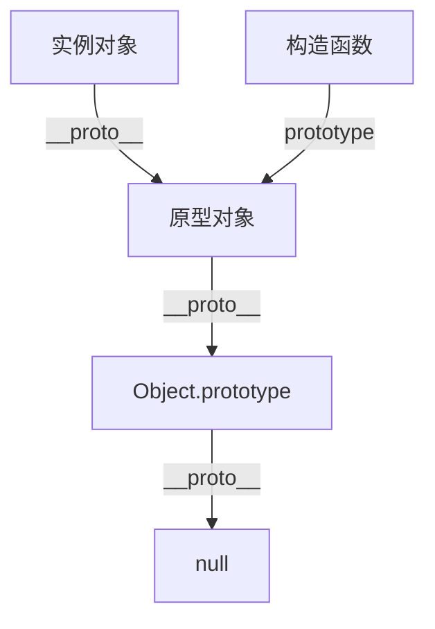
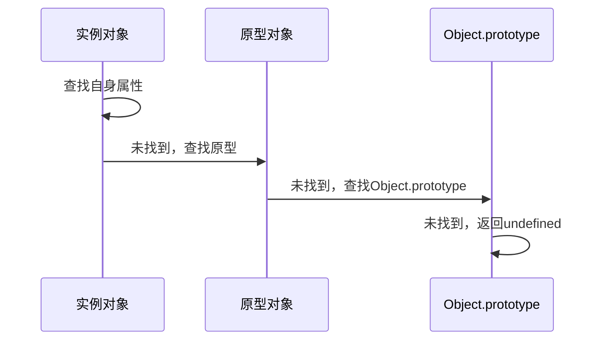

# JavaScript 原型和继承机制

JavaScript 通过原型链实现对象继承。每个对象都有一个原型对象，对象以其原型为模板、从原型继承方法和属性。

## 原型基础

### 原型链结构



### 核心概念

1. **prototype**：构造函数的属性，指向原型对象
2. **\_\_proto\_\_**：实例对象的属性，指向原型对象
3. **constructor**：原型对象的属性，指向构造函数

## 原型链示例

```javascript
// 构造函数
function Animal(name) {
    this.name = name;
}

// 原型方法
Animal.prototype.sayName = function() {
    return this.name;
};

// 实例化
const cat = new Animal('Cat');

// 原型链查找
cat.sayName();  // 'Cat'
cat.toString(); // 从 Object.prototype 继承
```

### 原型链查找流程



## 继承实现

### 1. 原型链继承

```javascript
function Animal(name) {
    this.name = name;
}

function Cat(name) {
    Animal.call(this, name);
}

Cat.prototype = Object.create(Animal.prototype);
Cat.prototype.constructor = Cat;
```

### 2. Class 语法继承

```javascript
class Animal {
    constructor(name) {
        this.name = name;
    }
    
    sayName() {
        return this.name;
    }
}

class Cat extends Animal {
    constructor(name) {
        super(name);
    }
}
```

## 原型方法

### Object 原型方法

1. **Object.create()**
   ```javascript
   const child = Object.create(parent);
   ```

2. **Object.getPrototypeOf()**
   ```javascript
   const proto = Object.getPrototypeOf(obj);
   ```

3. **Object.setPrototypeOf()**
   ```javascript
   Object.setPrototypeOf(child, parent);
   ```

### 实例方法

1. **hasOwnProperty()**
   ```javascript
   obj.hasOwnProperty('propertyName');
   ```

2. **isPrototypeOf()**
   ```javascript
   parentObj.isPrototypeOf(childObj);
   ```

## 性能优化

1. **原型链深度**
   - 保持原型链扁平
   - 避免过深的继承层次

2. **属性查找**
   - 常用属性放在实例上
   - 共享方法放在原型上

3. **方法定义**
   ```javascript
   // 推荐：原型方法
   Constructor.prototype.method = function() {};
   
   // 避免：实例方法
   this.method = function() {};
   ```

## 最佳实践

1. **使用 class 语法**
   - 更清晰的继承语义
   - 内置的严格模式
   - 更好的性能优化

2. **合理使用继承**
   - 优先使用组合而非继承
   - 避免多重继承
   - 保持继承层次简单

3. **原型污染防护**
   ```javascript
   // 防止原型污染
   Object.freeze(Constructor.prototype);
   ```

## 注意事项

1. 原型属性共享导致的副作用
2. 构造函数返回值的影响
3. 继承时的属性屏蔽
4. 原型链的性能开销