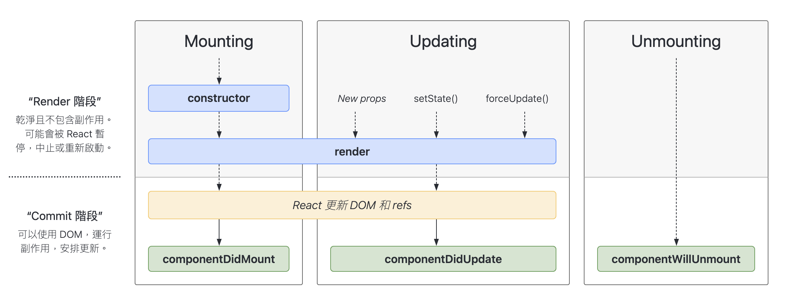

以下是按照苹果的标准格式化的 Markdown 内容：

# React 生命周期



React 组件生命周期分为三个主要阶段：挂载、更新和卸载。对于类组件，React 提供了一些方法，允许我们在组件生命周期的不同阶段执行代码。以下是一些常见的操作方法（注意，这些方法是类组件的生命周期方法，函数组件的概念有所不同）。

在 React 的 class component 中，生命周期分为三个主要阶段：mounting（挂载）、updating（更新）和 unmounting（卸载）。每个阶段都有特定的生命周期方法，触发的时机如下：

## 1. Mounting（挂载）

这个阶段是组件被创建并插入到 DOM 中的过程。相关的生命周期方法包括：

- `constructor(props)`：在组件实例化时调用，初始化状态和绑定方法。
- `static getDerivedStateFromProps(nextProps, prevState)`：在渲染之前调用，可以返回一个对象来更新状态，或返回 null 表示不更新。
- `render()`：必须实现的方法，返回要渲染的 JSX。
- `componentDidMount()`：组件挂载后调用，适合进行数据获取、添加事件监听等操作。

## 2. Updating（更新）

这个阶段是组件的状态或属性发生变化时的过程。相关的生命周期方法包括：

- `static getDerivedStateFromProps(nextProps, prevState)`：在更新时调用，功能与挂载阶段相同。
- `shouldComponentUpdate(nextProps, nextState)`：在渲染前调用，用于控制组件是否需要更新，返回 true 或 false。
- `render()`：更新时重新渲染组件。
- `componentDidUpdate(prevProps, prevState)`：组件更新后调用，可以用于处理更新后的 DOM 操作或网络请求。

## 3. Unmounting（卸载）

这个阶段是组件从 DOM 中移除的过程。相关的生命周期方法包括：

- `componentWillUnmount()`：在组件卸载之前调用，适合进行清理操作，如移除事件监听、取消网络请求等。

## 总结

1. Mounting：组件创建并插入 DOM。
   - 方法：constructor → getDerivedStateFromProps → render → componentDidMount
2. Updating：组件状态或属性更新。
   - 方法：getDerivedStateFromProps → shouldComponentUpdate → render → componentDidUpdate
3. Unmounting：组件从 DOM 中移除。
   - 方法：componentWillUnmount

------------------------------------------------

# React Hooks 与类组件生命周期的对应关系

## 1. Mounting（挂载）阶段

### constructor(props)
- Hook 等价：`useState` 和函数组件体
```javascript
function MyComponent(props) {
  const [state, setState] = useState(initialState);
  // 这里可以进行一些初始化操作
}
```

### static getDerivedStateFromProps(props, state)
- Hook 等价：`useState` 结合 `useEffect`
```javascript
function MyComponent(props) {
  const [state, setState] = useState(initialState);
  
  useEffect(() => {
    if (/* 需要更新状态的条件 */) {
      setState(/* 新的状态 */);
    }
  }, [/* 相关的 props */]);
}
```

### render()
- Hook 等价：函数组件的返回值
```javascript
function MyComponent() {
  return <div>组件内容</div>;
}
```

### componentDidMount()
- Hook 等价：`useEffect` with empty dependency array
```javascript
useEffect(() => {
  // 组件挂载后执行的操作
}, []);
```

## 2. Updating（更新）阶段

### shouldComponentUpdate(nextProps, nextState)
- Hook 等价：`React.memo` 和 `useMemo`

`React.memo` 是一个高阶组件，它可以将一个函数组件转换为一个记忆组件。记忆组件会对传入的 props 进行浅比较，如果 props 没有变化，则不会重新渲染组件。这样可以避免不必要的重新渲染，提高性能。
```javascript
const MyComponent = React.memo(function MyComponent(props) {
  // 组件逻辑
});
```
`useMemo` 是一个 Hook，它可以用于记忆一个值。它接收一个函数和一个依赖项数组作为参数。只有当依赖项数组中的值发生变化时，函数才会重新执行，并返回新的值。这样可以避免在每次渲染时重新计算这个值，提高性能。
```javascript
const memoizedValue = useMemo(() => computeExpensiveValue(a, b), [a, b]);
```

### componentDidUpdate(prevProps, prevState)
- Hook 等价：`useEffect` with dependencies
```javascript
useEffect(() => {
  // 在组件更新后执行的操作
}, [/* 相关的 state 或 props */]);
```

## 3. Unmounting（卸载）阶段

### componentWillUnmount()
- Hook 等价：`useEffect` 的清理函数
```javascript
useEffect(() => {
  // 组件挂载后的操作

  return () => {
    // 组件卸载前的清理操作
  };
}, []);
```

## 其他常用的 Hooks

1. `useContext`: 用于访问 React 的 Context
2. `useReducer`: 用于管理复杂的组件状态
3. `useCallback`: 用于优化性能，避免不必要的渲染
4. `useRef`: 用于保存可变值，不会触发重新渲染

## 总结

虽然 Hooks 不能完全一一对应类组件的生命周期方法，但它们提供了更灵活和可组合的方式来管理组件的副作用和状态。使用 Hooks，我们可以根据逻辑相关性组织代码，而不是根据生命周期方法强制拆分。

这个对照表展示了如何使用 Hooks 来实现与类组件生命周期方法相似的功能。需要注意的是，Hooks 的设计理念与类组件有所不同，它更注重逻辑的组合而非生命周期的分离。