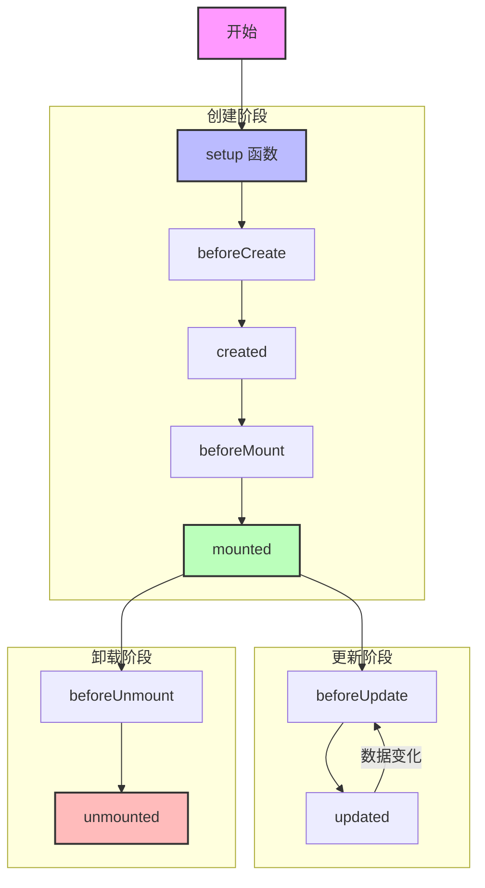
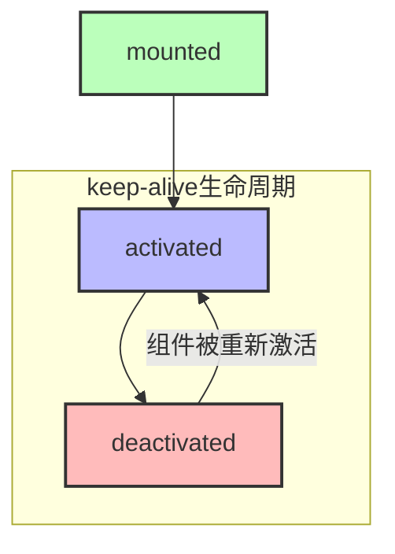
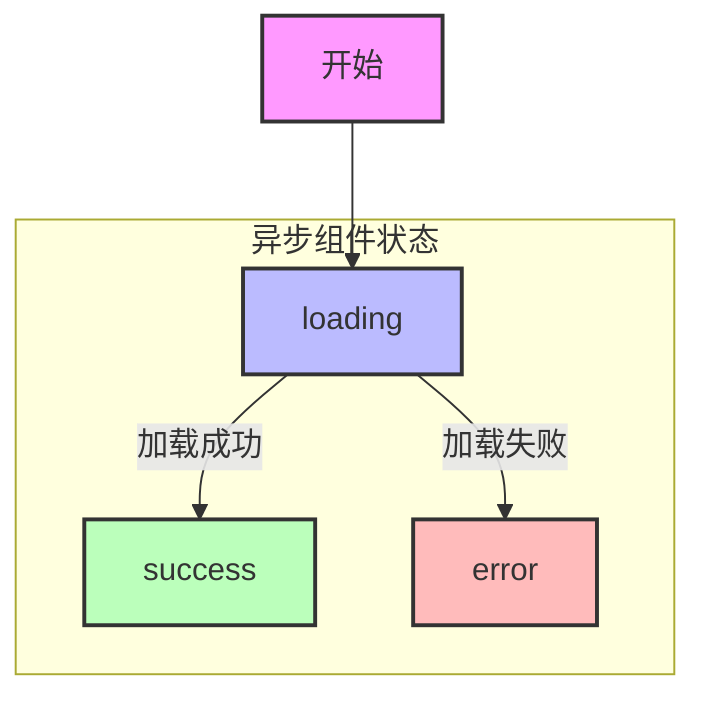

# Vue 生命周期

## 生命周期钩子概述

Vue 组件的生命周期包含了从创建到销毁的整个过程，通过不同的生命周期钩子，我们可以在特定的时机执行代码。

### 基本生命周期图示



### keep-alive 组件的生命周期



### 异步组件的生命周期



## 创建阶段

### setup 函数

`setup` 是 Composition API 的入口点，在组件创建之前执行。

```vue
<script setup>
import { ref, onMounted } from 'vue'

// setup 中的代码会在组件创建之前执行
const count = ref(0)

// 可以直接使用 await
const data = await fetchData()
</script>
```

### beforeCreate 和 created

> 注意：使用 `<script setup>` 时，这些钩子很少使用，因为 `setup` 函数本身就是在 `beforeCreate` 之前执行。

```vue
<script>
export default {
  beforeCreate() {
    console.log('beforeCreate: 组件实例被创建之前')
    // 此时无法访问组件的 data 和 methods
  },
  created() {
    console.log('created: 组件实例创建完成')
    // 可以访问组件的 data 和 methods
    // 适合执行：
    // 1. 数据初始化
    // 2. API 调用
    // 3. 事件监听器设置
  }
}
</script>
```

### beforeMount 和 mounted

```vue
<template>
  <div ref="elementRef">{{ message }}</div>
</template>

<script setup>
import { ref, onBeforeMount, onMounted } from 'vue'

const elementRef = ref(null)
const message = ref('Hello')

onBeforeMount(() => {
  console.log('beforeMount: DOM 挂载之前')
  console.log('elementRef 是否可用：', elementRef.value) // null
})

onMounted(() => {
  console.log('mounted: DOM 挂载完成')
  console.log('elementRef 是否可用：', elementRef.value) // DOM 元素
  // 适合执行：
  // 1. DOM 操作
  // 2. 第三方库初始化
  // 3. 数据请求
  // 4. 订阅事件
})
</script>
```

## 更新阶段

### beforeUpdate 和 updated

```vue
<template>
  <div>
    <p>计数: {{ count }}</p>
    <button @click="increment">增加</button>
  </div>
</template>

<script setup>
import { ref, onBeforeUpdate, onUpdated } from 'vue'

const count = ref(0)

function increment() {
  count.value++
}

onBeforeUpdate(() => {
  console.log('beforeUpdate: 数据更新，DOM 更新之前')
  // 适合在更新前访问现有的 DOM
  // 例如：手动保存滚动位置
})

onUpdated(() => {
  console.log('updated: DOM 更新完成')
  // 适合执行依赖于更新后 DOM 的操作
  // 注意：避免在这里修改数据，可能导致无限循环
})
</script>
```

## 卸载阶段

### beforeUnmount 和 unmounted

```vue
<script setup>
import { onBeforeUnmount, onUnmounted } from 'vue'

onBeforeUnmount(() => {
  console.log('beforeUnmount: 组件卸载之前')
  // 适合执行：
  // 1. 保存组件状态
  // 2. 取消定时器
  // 3. 移除事件监听器
})

onUnmounted(() => {
  console.log('unmounted: 组件已卸载')
  // 适合执行最终的清理工作
})
</script>
```

## 实际应用场景

### 1. 数据加载和错误处理

```vue
<template>
  <div>
    <div v-if="loading">加载中...</div>
    <div v-else-if="error">{{ error }}</div>
    <div v-else>
      <user-profile :user="userData" />
    </div>
  </div>
</template>

<script setup>
import { ref, onMounted } from 'vue'
import UserProfile from './UserProfile.vue'

const loading = ref(true)
const error = ref(null)
const userData = ref(null)

onMounted(async () => {
  try {
    const response = await fetch('/api/user')
    userData.value = await response.json()
  } catch (e) {
    error.value = '加载用户数据失败：' + e.message
  } finally {
    loading.value = false
  }
})
</script>
```

### 2. 第三方库集成

```vue
<template>
  <div ref="chartRef" class="chart-container"></div>
</template>

<script setup>
import { ref, onMounted, onBeforeUnmount } from 'vue'
import * as echarts from 'echarts'

const chartRef = ref(null)
let chart = null

onMounted(() => {
  // 初始化图表
  chart = echarts.init(chartRef.value)
  
  // 配置图表选项
  const option = {
    title: {
      text: '示例图表'
    },
    xAxis: {
      data: ['A', 'B', 'C', 'D']
    },
    yAxis: {},
    series: [{
      type: 'bar',
      data: [10, 20, 30, 40]
    }]
  }
  
  // 设置选项
  chart.setOption(option)
  
  // 添加窗口调整监听器
  window.addEventListener('resize', handleResize)
})

// 处理窗口调整
function handleResize() {
  chart?.resize()
}

onBeforeUnmount(() => {
  // 清理图表实例
  chart?.dispose()
  // 移除事件监听器
  window.removeEventListener('resize', handleResize)
})
</script>

<style scoped>
.chart-container {
  width: 100%;
  height: 400px;
}
</style>
```

### 3. 状态持久化

```vue
<template>
  <div>
    <input v-model="searchQuery" placeholder="搜索...">
    <div class="results">
      {{ searchResults }}
    </div>
  </div>
</template>

<script setup>
import { ref, watch, onMounted, onBeforeUnmount } from 'vue'

const STORAGE_KEY = 'search_state'
const searchQuery = ref('')
const searchResults = ref([])

// 从 localStorage 恢复状态
onMounted(() => {
  const savedState = localStorage.getItem(STORAGE_KEY)
  if (savedState) {
    const { query, results } = JSON.parse(savedState)
    searchQuery.value = query
    searchResults.value = results
  }
})

// 监听变化并保存状态
watch(
  [searchQuery, searchResults],
  ([query, results]) => {
    localStorage.setItem(STORAGE_KEY, JSON.stringify({
      query,
      results
    }))
  },
  { deep: true }
)

// 组件卸载前清理
onBeforeUnmount(() => {
  localStorage.removeItem(STORAGE_KEY)
})
</script>
```

### 4. 资源预加载

```vue
<template>
  <div>
    
    <div v-else class="loading-placeholder">
      加载中...
    </div>
  </div>
</template>

<script setup>
import { ref, onMounted } from 'vue'

const imageSrc = 'https://example.com/large-image.jpg'
const imageLoaded = ref(false)

onMounted(() => {
  const img = new Image()
  img.onload = () => {
    imageLoaded.value = true
  }
  img.src = imageSrc
})
</script>
```

## 生命周期最佳实践

### 1. 代码组织

```vue
<script setup>
import { ref, onMounted, onBeforeUnmount } from 'vue'

// 1. 状态定义
const state = ref(null)
const error = ref(null)

// 2. 计算属性和方法

// 3. 生命周期钩子
onMounted(async () => {
  try {
    // 初始化逻辑
  } catch (e) {
    error.value = e
  }
})

onBeforeUnmount(() => {
  // 清理逻辑
})

// 4. 事件处理器
function handleEvent() {
  // 事件处理逻辑
}
</script>
```

### 2. 性能优化

```vue
<script setup>
import { ref, onMounted, onActivated, onDeactivated } from 'vue'

// 使用 keep-alive 时的优化
onMounted(() => {
  // 仅首次加载时执行的昂贵操作
  performExpensiveOperation()
})

onActivated(() => {
  // 每次组件激活时的轻量级更新
  refreshData()
})

onDeactivated(() => {
  // 组件停用时的状态保存
  saveState()
})
</script>
```

### 3. 错误处理

```vue
<script setup>
import { onErrorCaptured } from 'vue'

// 捕获子组件错误
onErrorCaptured((err, instance, info) => {
  console.error('组件错误：', err)
  console.log('错误组件：', instance)
  console.log('错误信息：', info)
  
  // 返回 false 阻止错误继续传播
  return false
})
</script>
```

## 生命周期调试技巧

### 1. 使用调试钩子

```vue
<script setup>
import { onMounted, onUpdated, onBeforeUnmount } from 'vue'

// 开发环境下的调试钩子
if (process.env.NODE_ENV === 'development') {
  onMounted(() => {
    console.log('组件挂载时间：', performance.now())
  })
  
  onUpdated(() => {
    console.log('组件更新时间：', performance.now())
  })
  
  onBeforeUnmount(() => {
    console.log('组件存活时间：', performance.now())
  })
}
</script>
```

### 2. 性能分析

```vue
<script setup>
import { onMounted, onUpdated } from 'vue'

// 性能标记
onMounted(() => {
  performance.mark('component-mounted')
})

onUpdated(() => {
  performance.mark('component-updated')
  
  // 测量更新性能
  performance.measure(
    'update-duration',
    'component-mounted',
    'component-updated'
  )
  
  // 输出性能数据
  const measures = performance.getEntriesByName('update-duration')
  console.log('更新耗时：', measures[0].duration)
})
</script>
```

## 总结

1. **生命周期顺序**
   - 创建：setup > beforeCreate > created > beforeMount > mounted
   - 更新：beforeUpdate > updated
   - 卸载：beforeUnmount > unmounted

2. **最佳实践**
   - 在正确的生命周期钩子中执行相应的操作
   - 及时清理资源和事件监听器
   - 合理使用 keep-alive 相关钩子
   - 实现适当的错误处理

3. **常见用途**
   - mounted: DOM 操作、数据获取、第三方库初始化
   - updated: DOM 更新后的操作
   - beforeUnmount: 清理和资源释放

4. **性能考虑**
   - 避免在 updated 中修改数据
   - 合理使用异步操作
   - 适当的性能监控和调试
