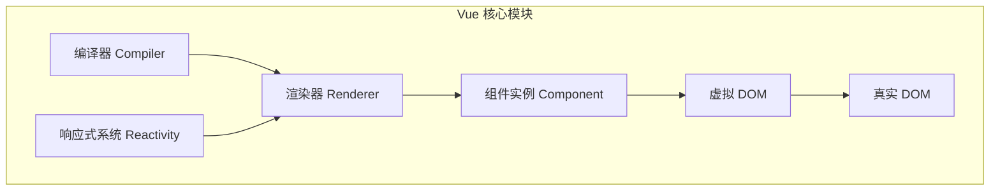
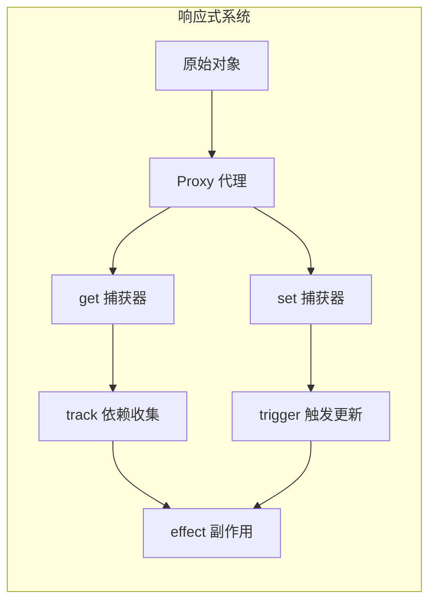
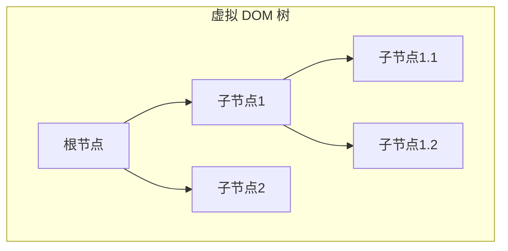
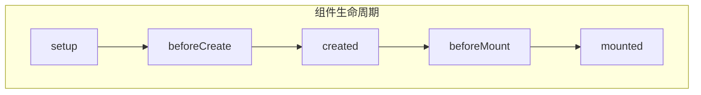

# Vue 原理深入

本文将通过流程图和核心代码实现，深入解析 Vue 的核心原理。

## Vue 整体架构



## 响应式系统

### Vue 3.x Proxy 实现



核心实现代码：

```typescript
// 存储响应式对象的 WeakMap
const targetMap = new WeakMap()

// 当前激活的 effect
let activeEffect: Function | undefined

/**
 * 创建响应式对象
 * @param target 目标对象
 * @returns Proxy 代理对象
 */
function reactive(target: object) {
  // 处理器对象
  const handler = {
    get(target: object, key: string | symbol, receiver: object) {
      // 收集依赖
      track(target, key)
      const result = Reflect.get(target, key, receiver)
      // 如果结果是对象，继续创建响应式
      return typeof result === 'object' ? reactive(result) : result
    },
    set(target: object, key: string | symbol, value: any, receiver: object) {
      const oldValue = (target as any)[key]
      const result = Reflect.set(target, key, value, receiver)
      // 如果值发生变化，触发更新
      if (oldValue !== value) {
        trigger(target, key)
      }
      return result
    }
  }
  
  return new Proxy(target, handler)
}

/**
 * 依赖收集
 * @param target 目标对象
 * @param key 属性键
 */
function track(target: object, key: string | symbol) {
  if (!activeEffect) return
  
  let depsMap = targetMap.get(target)
  if (!depsMap) {
    targetMap.set(target, (depsMap = new Map()))
  }
  
  let dep = depsMap.get(key)
  if (!dep) {
    depsMap.set(key, (dep = new Set()))
  }
  
  dep.add(activeEffect)
}

/**
 * 触发更新
 * @param target 目标对象
 * @param key 属性键
 */
function trigger(target: object, key: string | symbol) {
  const depsMap = targetMap.get(target)
  if (!depsMap) return
  
  const effects = depsMap.get(key)
  if (effects) {
    effects.forEach((effect: Function) => effect())
  }
}

/**
 * 创建副作用函数
 * @param fn 要执行的函数
 */
function effect(fn: Function) {
  const effectFn = () => {
    activeEffect = effectFn
    fn()
    activeEffect = undefined
  }
  effectFn()
  return effectFn
}

// 使用示例
const state = reactive({
  count: 0,
  message: 'Hello'
})

effect(() => {
  console.log('Count changed:', state.count)
})

state.count++ // 会触发 effect 函数执行
```

## 虚拟 DOM 实现



核心实现代码：

```typescript
// 虚拟节点接口定义
interface VNode {
  type: string | Component
  props: Record<string, any> | null
  children: VNode[] | string | null
  el: Element | null
  key: string | number | null
}

/**
 * 创建虚拟节点
 */
function h(
  type: string | Component,
  props: Record<string, any> | null = null,
  children: VNode[] | string | null = null
): VNode {
  return {
    type,
    props,
    children,
    el: null,
    key: props?.key ?? null
  }
}

/**
 * 挂载虚拟节点
 */
function mount(vnode: VNode, container: Element) {
  const el = document.createElement(vnode.type as string)
  vnode.el = el
  
  // 处理 props
  if (vnode.props) {
    for (const key in vnode.props) {
      if (key.startsWith('on')) {
        // 事件处理
        el.addEventListener(
          key.slice(2).toLowerCase(),
          vnode.props[key]
        )
      } else {
        // 属性设置
        el.setAttribute(key, vnode.props[key])
      }
    }
  }
  
  // 处理子节点
  if (typeof vnode.children === 'string') {
    el.textContent = vnode.children
  } else if (Array.isArray(vnode.children)) {
    vnode.children.forEach(child => mount(child, el))
  }
  
  container.appendChild(el)
}

/**
 * Diff 算法核心实现
 */
function patch(n1: VNode | null, n2: VNode, container: Element) {
  if (n1 == null) {
    // 新增节点
    mount(n2, container)
  } else if (n1.type !== n2.type) {
    // 节点类型不同，直接替换
    const parent = n1.el!.parentNode
    parent?.removeChild(n1.el!)
    mount(n2, container)
  } else {
    // 更新节点
    const el = (n2.el = n1.el!)
    
    // 更新 props
    const oldProps = n1.props || {}
    const newProps = n2.props || {}
    
    // 添加新的 props
    for (const key in newProps) {
      const oldValue = oldProps[key]
      const newValue = newProps[key]
      if (oldValue !== newValue) {
        if (key.startsWith('on')) {
          el.addEventListener(
            key.slice(2).toLowerCase(),
            newValue
          )
        } else {
          el.setAttribute(key, newValue)
        }
      }
    }
    
    // 删除旧的 props
    for (const key in oldProps) {
      if (!(key in newProps)) {
        if (key.startsWith('on')) {
          el.removeEventListener(
            key.slice(2).toLowerCase(),
            oldProps[key]
          )
        } else {
          el.removeAttribute(key)
        }
      }
    }
    
    // 更新子节点
    const oldChildren = n1.children
    const newChildren = n2.children
    
    if (typeof newChildren === 'string') {
      if (typeof oldChildren === 'string') {
        if (newChildren !== oldChildren) {
          el.textContent = newChildren
        }
      } else {
        el.textContent = newChildren
      }
    } else if (Array.isArray(newChildren)) {
      if (Array.isArray(oldChildren)) {
        // Diff 算法核心
        const commonLength = Math.min(oldChildren.length, newChildren.length)
        
        // 更新共有的节点
        for (let i = 0; i < commonLength; i++) {
          patch(oldChildren[i], newChildren[i], el)
        }
        
        // 添加新增的节点
        if (newChildren.length > oldChildren.length) {
          newChildren.slice(oldChildren.length).forEach(child => {
            mount(child, el)
          })
        }
        
        // 删除多余的节点
        if (oldChildren.length > newChildren.length) {
          oldChildren.slice(newChildren.length).forEach(child => {
            el.removeChild(child.el!)
          })
        }
      } else {
        // 旧的不是数组，直接替换
        el.innerHTML = ''
        newChildren.forEach(child => mount(child, el))
      }
    }
  }
}
```

## 组件系统



核心实现代码：

```typescript
interface ComponentInstance {
  vnode: VNode
  type: any
  props: Record<string, any>
  attrs: Record<string, any>
  slots: Record<string, any>
  ctx: any
  setup: Function | null
  render: Function | null
  subTree: VNode | null
  isMounted: boolean
  update: Function | null
}

/**
 * 创建组件实例
 */
function createComponentInstance(vnode: VNode): ComponentInstance {
  const instance: ComponentInstance = {
    vnode,
    type: vnode.type,
    props: {},
    attrs: {},
    slots: {},
    ctx: null,
    setup: null,
    render: null,
    subTree: null,
    isMounted: false,
    update: null
  }
  
  instance.ctx = { _: instance }
  return instance
}

/**
 * 设置组件实例
 */
function setupComponent(instance: ComponentInstance) {
  const { props, children } = instance.vnode
  
  // 初始化 props
  instance.props = props
  instance.slots = children
  
  setupStatefulComponent(instance)
}

/**
 * 设置有状态组件
 */
function setupStatefulComponent(instance: ComponentInstance) {
  const Component = instance.type
  
  // 创建渲染上下文代理
  instance.proxy = new Proxy(instance.ctx, {
    get({ _: instance }, key) {
      const { setupState, props } = instance
      
      if (key in setupState) {
        return setupState[key]
      } else if (key in props) {
        return props[key]
      }
    },
    set({ _: instance }, key, value) {
      const { setupState } = instance
      
      if (key in setupState) {
        setupState[key] = value
        return true
      }
      return false
    }
  })
  
  // 调用 setup 函数
  if (Component.setup) {
    const setupResult = Component.setup(instance.props, {
      emit: instance.emit
    })
    
    handleSetupResult(instance, setupResult)
  }
}

/**
 * 处理 setup 返回结果
 */
function handleSetupResult(instance: ComponentInstance, setupResult: any) {
  if (typeof setupResult === 'function') {
    instance.render = setupResult
  } else if (typeof setupResult === 'object') {
    instance.setupState = setupResult
  }
  
  finishComponentSetup(instance)
}

/**
 * 完成组件设置
 */
function finishComponentSetup(instance: ComponentInstance) {
  const Component = instance.type
  
  if (!instance.render) {
    if (Component.template && !Component.render) {
      // 编译模板
      Component.render = compile(Component.template)
    }
    instance.render = Component.render
  }
}
```

## 总结

Vue 的核心原理主要包括：

1. **响应式系统**：通过 Proxy 实现数据的响应式处理，包括依赖收集和触发更新。

2. **虚拟 DOM**：使用 JavaScript 对象描述 DOM 结构，通过 Diff 算法高效更新真实 DOM。

3. **组件系统**：
   - 组件实例创建和初始化
   - 生命周期管理
   - 组件状态管理
   - 组件更新机制

4. **编译优化**：
   - 静态节点提升
   - 动态节点追踪
   - Patch flags 优化

这些核心实现共同构成了 Vue 的运行时系统，使其能够高效地构建用户界面并响应数据变化。
